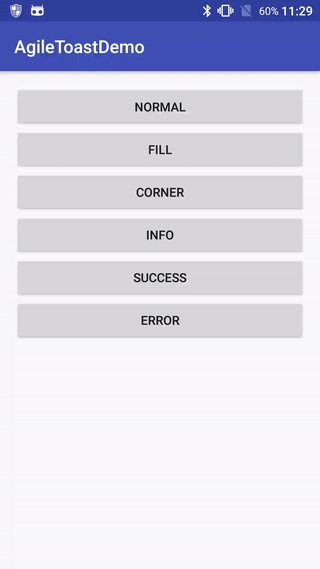

### AgileToast


A simple and more powerful Toast.





### Usage


The base usage:

```java
   AgileToast.Companion.build(MainActivity.this)
            .text("Some message.")
            .show();
```

More Advance usage:

```java
AgileToast.Companion.build(MainActivity.this)
            .type(ToastType.NORMAL)
            .text("AgileToast send msg...")
            .animation(AnimationType.ANIMATION_DRAWER_BOTTOM)
            .duration(Duration.DURATION_CUSTOM, 1000L)
            .style(ToastStyle.FILL)
            .gravity(Gravity.CENTER | Gravity.BOTTOM)
            .offsetY(200)
            .dismissCallback(MainActivity.this)
            .bgColor(ResourcesCompat.getColor(getResources(), R.color.colorAccent, null))
            .show();
```
